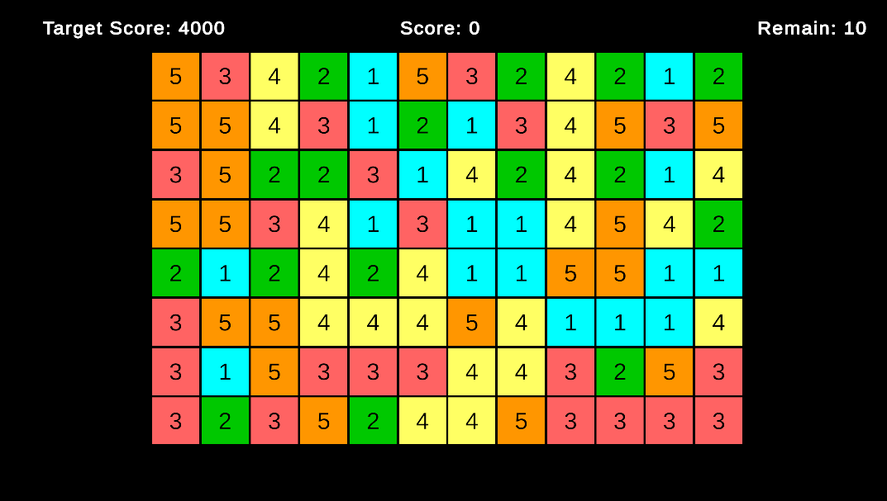
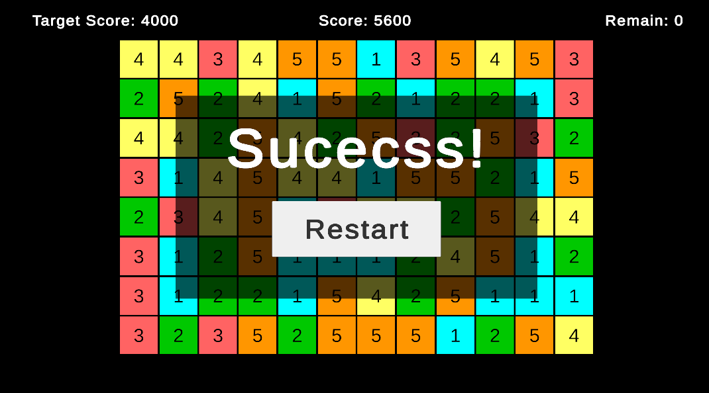
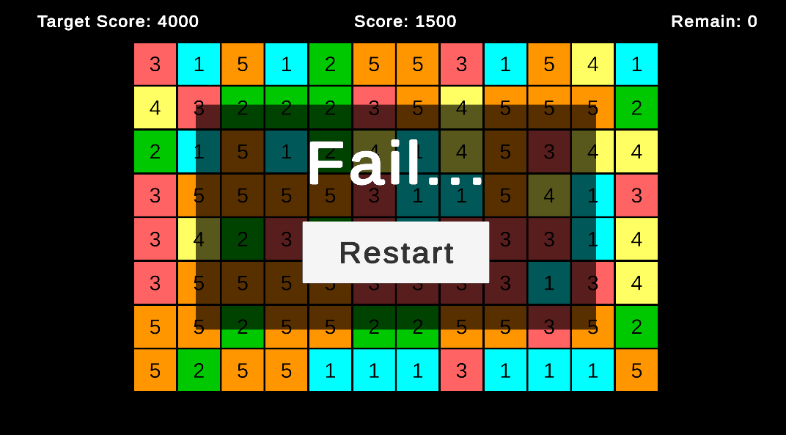

# 🧩 Unity Puzzle Game – 전략 & SOLID 기반 퍼즐 게임

## 🖥️ 게임 스크린샷

---

## 🎮 프로젝트 소개

Unity 6 기반으로 개발한 N x M 퍼즐 게임입니다.  
플레이어는 제한된 클릭 횟수 내에 같은 숫자의 블록을 제거하며 목표 점수 도달을 노립니다.  
**전략 패턴**과 **옵저버 패턴**, **SOLID 원칙**을 적용하여 구조적 설계와 유지보수성을 중점적으로 고려했습니다.

---

## 💻 개발환경 및 기술스택

-   **엔진**: Unity 6
-   **언어**: C#
-   **UI 시스템**: TextMeshPro
-   **설계 원칙**:
    -   SOLID
    -   KISS (Keep It Simple, Stupid)
    -   DRY (Don’t Repeat Yourself)
-   **디자인 패턴 적용**:
    -   Strategy Pattern
    -   Observer Pattern

---

## 🧩 게임 플레이 방법

1. N x M 퍼즐 보드가 자동 생성됩니다.
2. 블록에는 1~N의 숫자가 무작위로 배정됩니다.
3. 플레이어는 숫자 블록을 클릭해 **상하좌우 인접한 같은 숫자의 블록**을 제거합니다.
4. 제거된 블록 위의 블록들이 아래로 낙하하고, 새로운 블록이 생성됩니다.
5. 총 5번의 클릭 내에 **목표 점수**에 도달하면 성공, 그렇지 않으면 실패입니다.

---

## ⚙️ 주요 시스템 설계 및 특징

### 🎯 1. GameManager 중심의 흐름 제어

-   `GameManager`는 게임의 상태 흐름과 시스템 간의 연결을 총괄
-   `ClickHandler`, `GridManager`, `UIManager`를 관리하며 외부 전략 객체(성공 조건, 점수 계산기)를 주입받음
-   **게임 흐름**
    1. 블록 클릭 → 매칭된 블록 탐색
    2. 애니메이션 → 블록 제거
    3. 낙하 처리 → 새로운 블록 생성
    4. 점수 반영 → 성공/실패 판단

---

### 🧠 2. 전략 패턴 (Strategy Pattern) 적용

-   `IScoreCalculator` : 제거 블록 수 × 100점 기본 계산  
    → 콤보 기반, 시간 보너스 등 전략으로 확장 가능
-   `ISuccessCondition` : 목표 점수 이상이면 성공  
    → 블록 수, 클릭 수 등 복합 전략 가능
-   GameManager는 전략의 내부 구현에 의존하지 않고 결과를 판정

---

### 📡 3. 옵저버 패턴 (Observer Pattern)으로 UI 분리

-   `GameEvents`를 통해 점수, 클릭 수, 게임 종료 이벤트를 브로드캐스트
-   `UIManager`는 이벤트 구독 방식으로 반응 → 게임 로직과 UI 완전 분리
-   테스트 및 유지보수 용이, 새로운 UI 추가 시 코드 수정 없음

---

### 🧩 4. Grid 시스템과 블록 매칭 알고리즘

-   `GridManager` : 2차원 배열로 블록 위치 관리, 좌표 기반 조회 및 수정
-   `BlockMatcher` : DFS 기반 상하좌우 인접 블록 탐색 알고리즘
-   `BlockFallHandler` : 빈 공간을 기준으로 위에서 블록 낙하, 새 블록 생성
    → 모든 블록이 일정한 속도로 자연스럽게 낙하되도록 구현

---

### 🎨 5. UI 및 점수 시스템 구조화

-   TextMeshPro 기반 점수, 클릭 수, 목표 점수 표시
-   `UIManager`에서 상태 변화마다 점수 UI 갱신 및 결과 패널 표시
-   게임 시작 시 UI 초기화 및 이벤트 구독 자동 처리

---

### ♻️ 6. SOLID 원칙 기반 구조 설계

| 원칙    | 적용 예시                                                                 |
| ------- | ------------------------------------------------------------------------- |
| **SRP** | 각 클래스가 명확히 단일 책임만 가짐 (`UIManager`, `BlockFallHandler` 등)  |
| **OCP** | 전략 클래스는 확장에는 열려 있고 변경에는 닫혀 있음                       |
| **LSP** | 전략 객체 교체 시도에도 기존 구조 그대로 유지됨                           |
| **ISP** | 인터페이스는 작고 목적에 집중됨 (`IScoreCalculator`, `ISuccessCondition`) |
| **DIP** | `UIManager`는 `ClickHandler`를 직접 참조하지 않고 의존성 주입 방식 사용   |

---

## 🔭 향후 확장 방향

-   ✅ 콤보 기반 점수 계산 전략 추가
-   ✅ 특수 블록 (폭탄, 무작위 등) 구현
-   ✅ 상태 패턴 도입 (게임 대기, 낙하 처리, 결과 등)
-   ✅ 사운드 시스템과 애니메이션 이벤트 확장
-   ✅ JSON 기반의 스테이지 시스템 구현

---

## 🌐 데모 및 저장소 링크

-   **🕹️ Web Demo**: [실행하기](http://mayquartet.com/my_htmls/Brick_Block/index.html)
-   **📦 GitHub Repository**: https://github.com/ralskwo/BrickBlock

---

## 📄 라이선스

본 프로젝트는 개인 포트폴리오 용도로 사용되며, 상업적 용도 사용은 허가되지 않습니다.
